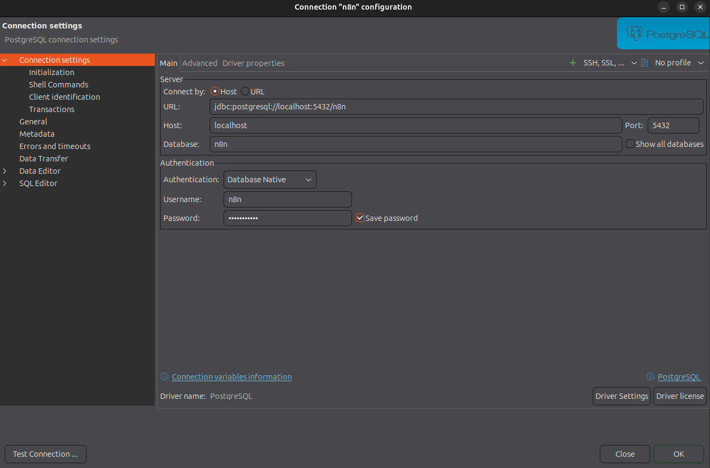

# DI01-Starter_stack_Partie_1
Starter stack pour Data Engineers - Partie 1

Veille :
* partie1/Veille sur les types de sources en entreprise V1.md

les deux fichiers de sortie sont :
* partie2/daily_summary_2025-10-15.csv
* partie2/output.db (SQLite)

## structure
* n8n_data/
* n8n_files/init
* n8n_files/input
* n8n_files/output
* n8n_files/done
* n8n_files/error

## pour la mise en route
```
sudo chown -R 1000:1000 ./n8n_data ./n8n_files
# (optionnel, permissifs mais efficaces en dev)
sudo find ./n8n_data -type d -exec chmod 700 {} \;
sudo find ./n8n_data -type f -exec chmod 600 {} \;
```

Le host pour postgres : `postgres`


```
CREATE TABLE IF NOT EXISTS order_items (
  line_id       BIGSERIAL PRIMARY KEY,
  order_id      TEXT NOT NULL,
  customer_id   TEXT NOT NULL,
  channel       TEXT NOT NULL,
  created_at    TIMESTAMP NOT NULL,
  payment_status TEXT NOT NULL,
  sku           TEXT NOT NULL,
  qty           INTEGER NOT NULL,
  unit_price    NUMERIC(10,2) NOT NULL,
  item_index    INTEGER NOT NULL DEFAULT 1,
  inserted_at   TIMESTAMP NOT NULL DEFAULT NOW()
);

CREATE UNIQUE INDEX IF NOT EXISTS ux_order_items_natural
  ON order_items(order_id, sku, item_index);

CREATE TABLE public.order_items_brut (
	line_id bigserial NOT NULL,
	order_id text NOT NULL,
	customer_id text NOT NULL,
	channel text NOT NULL,
	created_at timestamp NOT NULL,
	payment_status text NOT NULL,
	sku text NOT NULL,
	qty int4 NOT NULL,
	unit_price numeric(10, 2) NOT NULL,
	item_index int4 DEFAULT 1 NOT NULL,
	inserted_at timestamp DEFAULT now() NOT NULL,
	CONSTRAINT order_items_brut_pkey PRIMARY KEY (line_id)
);
```

## accès à Postgres



